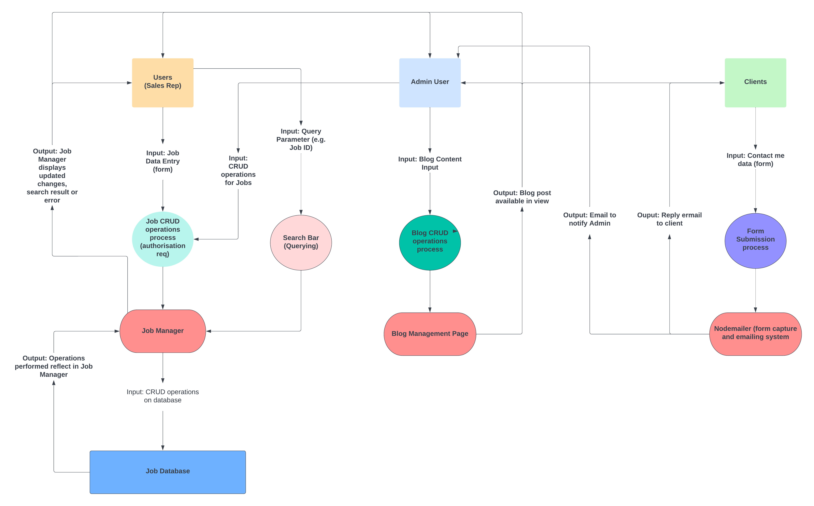
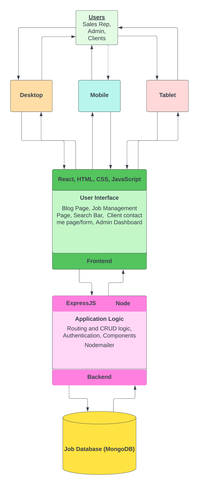
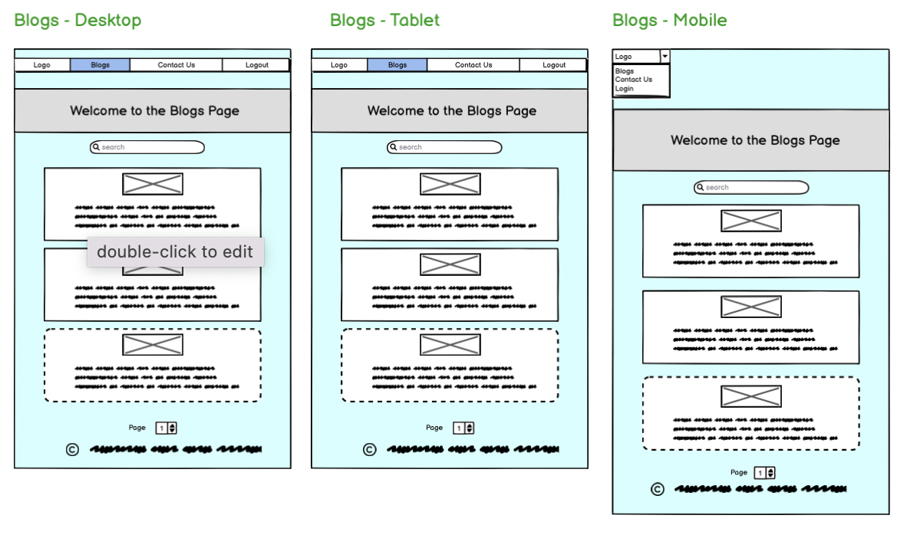
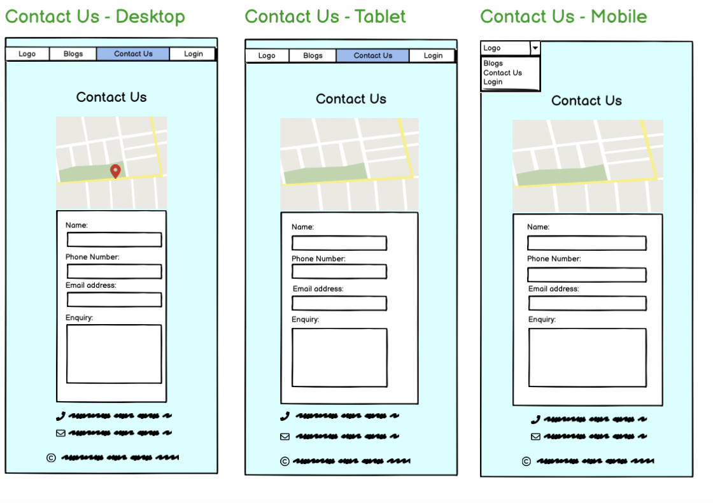
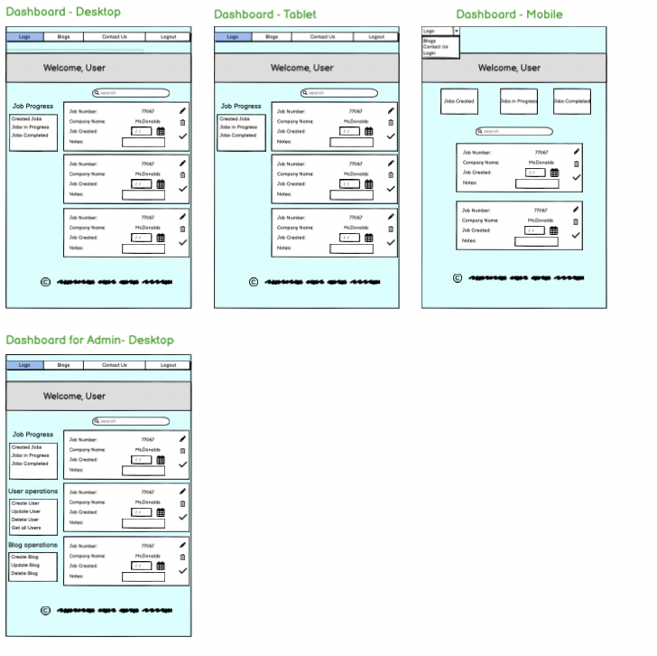
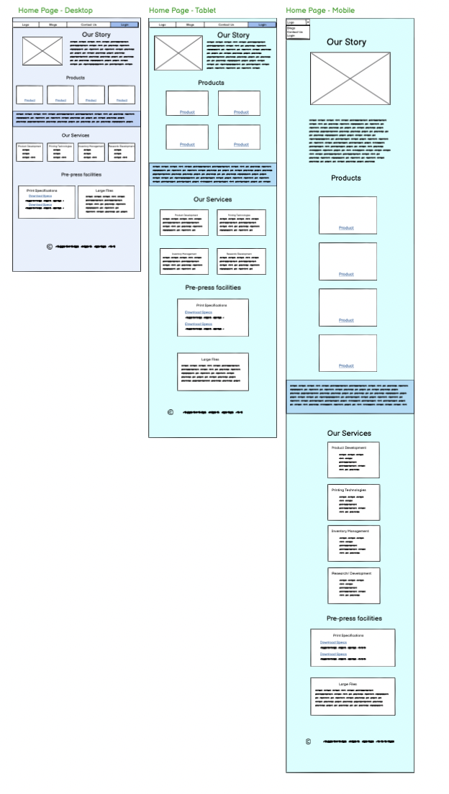
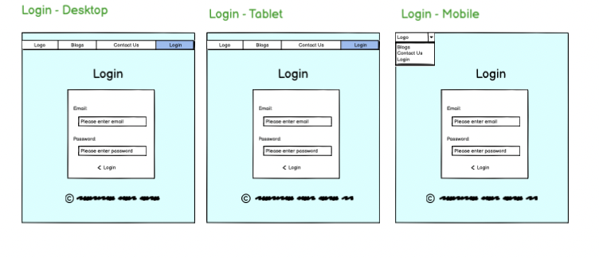
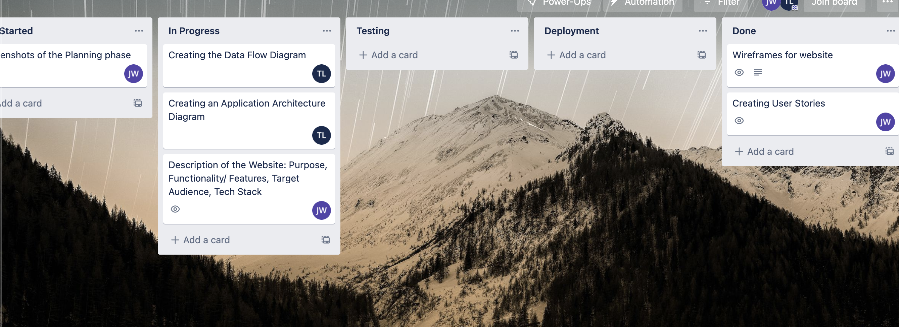
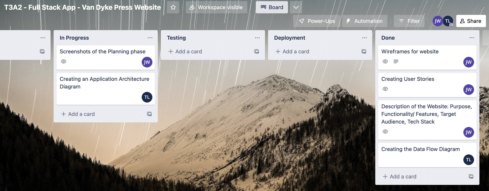

# **Van Dyke Press Application**

## Purpose

---

 
Van Dyke Press - A printing company that produces specialty food grade labels have requested the recreation of an existing website. The websites main objective is to advertise the variety of labels that the company can produce and what Van Dyke Press is all about. The client is looking for a modern cutting edge look to illustrate how the company is the leader in their field.

The company will experience ongoing development in the future years and will want to showcase that through Blog posts which will keep the user updated on the company.

In the past, there have been trouble with client jobs being misplaced/ not recorded which has resulted in miscommunication between the company and their clients. Therefore a login system with a private dashboard for the sales representatives that deal with all job orders will be needed to keep track of each job lifecycle.

The company will need a page providing contact information to be sent to the owner for any enquiries for potential leads on new jobs.
 
 

## Functionality/Features

---

 

**Home Page**
 
 
The Home page is one of the most integral parts for the owner of the company, to draw the attention of the viewer and portray what the company does and the different products that available. For that reason there will be several different <strong>animations/effects </strong>the Home Page will have to captivate, such as scale effects, flippable cards, on scroll animations and more. The Layout of the page along with varying colour pallets will help distinguish different elements of the page to show separation.
 
 

**Login Page**
 
 
There will be a login page where the sales representatives of the company can login with their private login credentials and upon successful login, take them to their private dashboard. The owner does not wish anyone viewing the website to be able to create an account, therefore the owner has the role of admin who has the ability to create new users. Therefore there will be register page.
 
 

**Dashboard Page**
 
 
The Dashboard will be home for the sales representatives so that they can create and update different jobs that come in to the company and categorize the job based on the process the job is at. To access a certain job more easily, a search bar will be in place. Three different buttons will be in place to locate to jobs of a certain process category (Job Created, Job in Progress, Job Completed, Job Sent Out). A logout button will be present so that the user can leave whenever they wish.
 
 

The <strong>Admin</strong> will have a slightly different Dashboard. They will have have all the abilities of the sales reps whilst also having additional privileges such as:

- Creating/Updating/Deleting colleagues login credentials
- Creating/Updating/Deleting Blog Posts
- Contact Us emails from potential clients delivered to admins inbox
   
   

**Contact Us Page**
 
 
The Contact Us page will have a form which potential clients can fill out and send for any enquiries to the admins inbox. The page will also have a google map, showing the location of the company. The form will not be able to send if there are missing fields/ invalid details. A Phone number and email address will also be provided for future correspondence.
 
 

**Blogs Page**
 
 
The Blogs Page will show the recent developments of the company. The blogs will be shown from most recent to least recent and will have pagination so that the blogs can be separated into separate pages. There will be a search bar according to the blog title for easy location of a blog. Each blog will have an image which will be saved on cloudinary so that storage is not an issue.
 
 

## Target Audience

---

As mentioned above the target audience are the potential clients that are interested in labels for their product.

 
 

## Tech Stack

---

 
 

The technologies that will be used to develop the website are:

- MongoDb
- Express
- Node
- React

Together they are what is known as the <strong>MERN Stack</strong>.
 
 

## Dataflow Diagram

---

 
 

 
 
 

## Application Architecture Diagram

---

 
 
 

## User Stories

---

 
 

As a <strong>potential client</strong>:
i would like to observe the different services available through an accessible and eye catching website (responsive) that draws my attention.
I would like to be able to contact the owner for any enquiries and be able to see where the company is located for reference.
 
 

As a <strong>user</strong>:
I would like a private login that takes me to my dashboard where i am able to create and log the jobs that come in and be able to process them through every stage from job creation through to completion.
I would like to be able to separate all jobs (through search/querying) according to what stage the job is at for easy accessibility.
 
 

As an <strong>Admin</strong>:
I would like the privileges a User has.
On my Admin dashboard, i do not want any person to be able to create a user(employee), that is my job.
I would like to create blogs so that potential clients can keep up with the developments of the company. The blogs should be able to have images attached and displayed from most recently created.
 
 
 

## Wireframes

---

 
 

## Screenshots of the Trello Board

---

 
 

